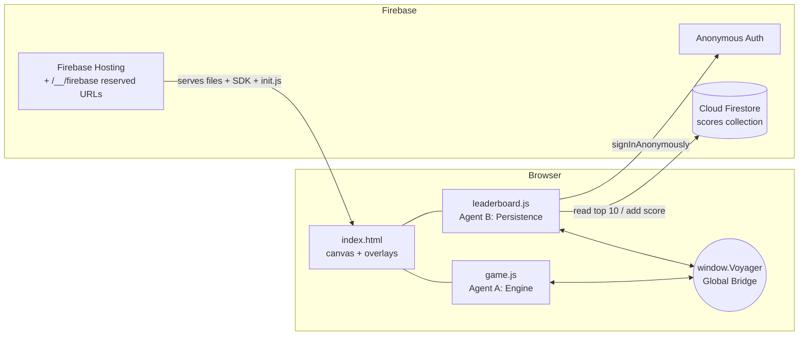
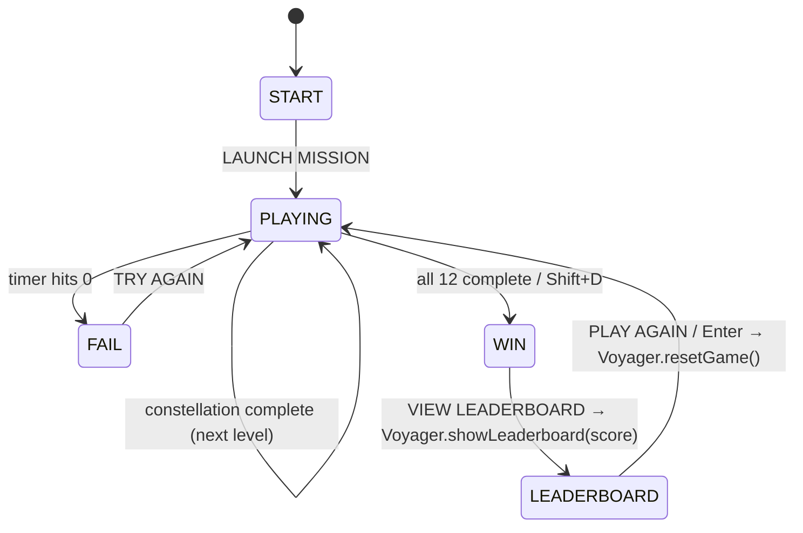
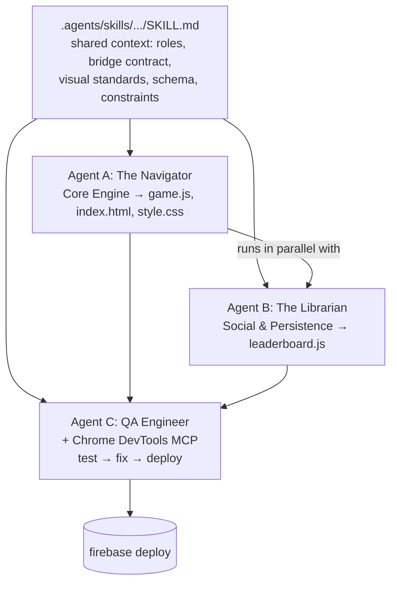

# VOYAGER: Starcatcher

> A retro-future arcade space game built by **orchestrating multiple AI agents in Google Antigravity** and deployed on **Firebase Hosting + Cloud Firestore + Anonymous Authentication**.

You are Astronaut 311-C, humanity's best pilot. Fly your ship between the stars of the 12 Zodiac constellations before time runs out. Each constellation gives you less time. Connect all twelve and you meet **Zarg 966-Z** of Zargaborg. Then put your initials on the global leaderboard.

This repository is a **tutorial project**. The game is the end product, but the real subject is the process: how three agents with separate roles, one shared `SKILL.md`, and a handful of Firebase services produced a working, deployed web app. This README documents both the code and the process so you can reproduce it, understand it, and extend it.

---

## Table of Contents

1. [What You Will Learn](#1-what-you-will-learn)
2. [Tech Stack](#2-tech-stack)
3. [Project Structure](#3-project-structure)
4. [Quick Start](#4-quick-start)
5. [How to Play](#5-how-to-play)
6. [Architecture](#6-architecture)
7. [Firebase Setup (From Scratch)](#7-firebase-setup-from-scratch)
8. [Running Locally with the Emulators](#8-running-locally-with-the-emulators)
9. [Deploying to Production](#9-deploying-to-production)
10. [Firestore Data Model and Security Rules](#10-firestore-data-model-and-security-rules)
11. [How the Game Was Built: Multi-Agent Orchestration](#11-how-the-game-was-built-multi-agent-orchestration)
12. [QA Checklist (Agent C's Validation Loop)](#12-qa-checklist-agent-cs-validation-loop)
13. [Prompt Engineering Lessons](#13-prompt-engineering-lessons)
14. [Maintenance: Cleaning Up the Leaderboard](#14-maintenance-cleaning-up-the-leaderboard)
15. [Troubleshooting](#15-troubleshooting)
16. [Known Quirks and Improvement Ideas](#16-known-quirks-and-improvement-ideas)
17. [References](#17-references)

---

## 1. What You Will Learn

- How to set up **Firebase Hosting, Firestore, and Anonymous Auth** for a static web app.
- How to use **Firebase Hosting reserved URLs** (`/__/firebase/...`) so you never hardcode a `firebaseConfig`.
- How to write a **Firestore security rule** that validates the shape of every document written to it.
- How to test everything locally with the **Firebase Emulator Suite** before deploying.
- How to split one project across **multiple AI agents** with clear file ownership and a shared communication contract.
- How to write an agent **skill (`SKILL.md`)** that gives every agent the same context.
- How to give a QA agent "hands" with an **MCP server** (Chrome DevTools MCP) so it can play-test and fix the game.
- Prompt engineering techniques: the **six question words**, **prompt chaining**, **fail/refine/repeat**, and Antigravity agent actions (`/grill-me`, `/goal`, `/schedule`).

---

## 2. Tech Stack

| Layer            | Technology                                         | Why                                                              |
| ---------------- | -------------------------------------------------- | ---------------------------------------------------------------- |
| Rendering        | HTML5 Canvas 2D (800×600)                          | Fast 2D drawing without extra libraries                          |
| Game logic       | Vanilla JavaScript (IIFE modules, no build step)   | No bundler, no `npm install`. Firebase Hosting serves the files as-is |
| UI / Styling     | CSS3 + Google Font *Press Start 2P*                | Retro arcade look for overlays and typography                    |
| Graphics assets  | Canvas drawing + one inline SVG (Zarg 966-Z)       | No external image files (project constraint)                     |
| Hosting          | Firebase Hosting                                   | Static hosting on a global CDN, plus reserved SDK URLs           |
| Database         | Cloud Firestore                                    | Serverless document DB for the leaderboard                       |
| Identity         | Firebase Anonymous Authentication                  | Every player gets a `uid` without a login screen                 |
| Firebase SDK     | v12.8.0 **compat** build, loaded from reserved URLs | Global `firebase` namespace works with plain `<script>` tags   |
| Dev tooling      | Firebase CLI, Firebase Emulator Suite              | Local testing and one-command deploy                             |
| AI tooling       | Google Antigravity, Gemini models, Chrome DevTools MCP | Agents wrote, tested and deployed the code                  |

---

## 3. Project Structure

```
gcp-agentic-architect/            ← repository root
├── .agents/
│   └── skills/
│       └── game-orchestration/
│           └── SKILL.md          ← Shared context for Agents A, B and C (skill name: "orchestration")
└── agy-game/                     ← this project (Firebase project directory)
    ├── public/                   ← Everything that gets deployed to Firebase Hosting
    │   ├── index.html            ← Page shell: canvas, 4 overlay screens, Zarg SVG, Firebase SDK tags
    │   ├── style.css             ← Retro neon theme, overlays, leaderboard table
    │   ├── game.js               ← Agent A: engine, physics, constellations, state machine
    │   └── leaderboard.js        ← Agent B: Firebase init, anonymous auth, Firestore reads/writes
    ├── firebase.json             ← Hosting, Firestore and Emulator configuration
    ├── .firebaserc               ← Default Firebase project alias (agy-sandbox-4a603)
    ├── firestore.rules           ← Security rules (includes validated `scores` rule)
    ├── firestore.indexes.json    ← Composite indexes (none needed)
    ├── firebase-config.js        ← Legacy config stub. NOT served and NOT used by the game (see §16)
    ├── package.json              ← npm metadata only. No dependencies, no build scripts
    ├── firebase                  ← (git-ignored) standalone Firebase CLI binary, optional
    └── .firebase/                ← (git-ignored) Hosting deploy cache
```

### File ownership

The file split comes straight from the orchestration skill. Each agent owned its own files so that agents working in parallel did not overwrite each other.

| File                  | Owner                      | Responsibility                                                    |
| --------------------- | -------------------------- | ----------------------------------------------------------------- |
| `public/game.js`      | **Agent A** (Core Engine)  | Game loop, physics, constellation data, local state, HUD          |
| `public/leaderboard.js` | **Agent B** (Persistence) | Firebase init, Firestore queries, initials form, leaderboard UI  |
| `public/index.html`, `public/style.css` | Created by Agent A, **shared** | All agents may read and write          |
| Any file              | **Agent C** (Validation)   | Tests the game end to end and fixes bugs wherever they are        |

---

## 4. Quick Start

**Prerequisites**

- [Firebase CLI](https://firebase.google.com/docs/cli) (`firebase --version` → this project was built with **15.30.2**)
- Java 11+ (required by the Firestore emulator)
- A Firebase project with Firestore and Anonymous Auth enabled (see [§7](#7-firebase-setup-from-scratch))

```bash
cd agy-game

# 1. Log in and point the project at YOUR Firebase project
firebase login
firebase use --add            # or edit .firebaserc and replace agy-sandbox-4a603

# 2. Play locally (Hosting on :5000, Firestore on :8080, Emulator UI on :4000)
firebase emulators:start
#    → open http://127.0.0.1:5000

# 3. Deploy rules + site to production
firebase deploy
#    → open https://<your-project-id>.web.app
```

> **Opening `public/index.html` straight from disk (`file://`) will not work.** The Firebase SDK loads from `/__/firebase/...` reserved URLs, and only Firebase Hosting or the Hosting emulator serves those.

---

## 5. How to Play

### Story

The start, fail and win screens use exact narrative strings from the course design:

- **Start:** *"Astronaut 311-C, As humanity's best pilot, you have been selected for a crucial, top-secret mission: to find extraterrestrial life…"*
- **Fail:** *"You have failed your mission, Astronaut 311-A. Humanity remains alone among the stars. Unless you choose to try again…"*
- **Win:** *"Hello, traveler. I am Zarg 966-Z. Welcome to Zargaborg!"* followed by the inline SVG portrait of Zarg, then *"I just pumped some fresh oxygen into my biosphere! So come on in, kick your boots off, and tell me all about your travels."*

### Controls

| Key            | Action                                                     |
| -------------- | ---------------------------------------------------------- |
| Arrow keys     | Move the ship (8 directions, diagonals are normalized)     |
| `Shift`        | Boost: 2× speed (pink thruster flame)                      |
| `Z`            | Brake: 0.5× speed (cyan thruster flame)                    |
| `Enter`        | On the leaderboard: submit initials, or restart the game   |
| `Shift` + `D`  | **Developer shortcut:** skip straight to the WIN screen (only while playing) |

### Objective

- One Zodiac constellation appears at a time. The **target star** has a pulsing yellow ring, and a yellow arrow next to your ship points to it.
- Fly within **26 px** of the target star to connect it. Connected stars glow cyan and are joined by solid neon lines. Dotted guide lines show the path still ahead.
- Connect every star in the constellation before the timer reaches zero. The timer turns red below 5 seconds.
- Complete all 12 constellations to win. If the timer runs out on any level, the mission fails.

### Levels and time limits

| # | Constellation              | Stars | Time (s) |
| - | -------------------------- | ----- | -------- |
| 1 | Aries (The Ram)            | 4     | 32       |
| 2 | Taurus (The Bull)          | 6     | 30       |
| 3 | Gemini (The Twins)         | 6     | 28       |
| 4 | Cancer (The Crab)          | 5     | 26       |
| 5 | Leo (The Lion)             | 7     | 24       |
| 6 | Virgo (The Maiden)         | 7     | 22       |
| 7 | Libra (The Scales)         | 5     | 21       |
| 8 | Scorpio (The Scorpion)     | 7     | 20       |
| 9 | Sagittarius (The Archer)   | 6     | 19       |
| 10 | Capricorn (The Sea-Goat)  | 5     | 18       |
| 11 | Aquarius (The Water-Bearer) | 6   | 16       |
| 12 | Pisces (The Fishes)       | 7     | 15       |

The coordinates are hand-tuned positions on the 800×600 canvas (`CONSTELLATIONS` in `game.js`). They are not astronomical data.

### Scoring

| Event                          | Points                                    |
| ------------------------------ | ----------------------------------------- |
| Each star connected            | +150                                      |
| Each constellation completed   | +500                                      |
| Time bonus per constellation   | +100 × seconds remaining (floored)        |
| `Shift` + `D` shortcut         | Score becomes `max(current score, 5000)`  |

Only winning runs reach the leaderboard. A failed run does not submit a score.

---

## 6. Architecture

### High-level view



### The Global Bridge (`window.Voyager`)

`game.js` and `leaderboard.js` never import each other. They talk only through a shared global object. The orchestration skill defines this contract, and it is what let two agents build the two halves in parallel.

| Member                                   | Defined by       | Purpose                                                         |
| ---------------------------------------- | ---------------- | --------------------------------------------------------------- |
| `Voyager.STATE`                          | `game.js`        | Enum: `START`, `PLAYING`, `FAIL`, `WIN`, `LEADERBOARD`          |
| `Voyager.state`                          | `game.js`        | Current state                                                   |
| `Voyager.score`                          | `game.js`        | Current run's score                                             |
| `Voyager.resetGame()`                    | `game.js`        | Starts a fresh run (called by the leaderboard's "Play Again")   |
| `Voyager.showLeaderboard(score)`         | `leaderboard.js` | Shows the leaderboard overlay and the initials form for `score` |

`game.js` installs a **stub** `showLeaderboard` if `leaderboard.js` has not defined one yet. Because `game.js` loads first, `leaderboard.js` then replaces the stub. The stub let Agent A test the engine before Agent B's file existed. The `onerror` handler on the `leaderboard.js` script tag serves the same purpose.

### State machine



Each state maps to one overlay `<div>` in `index.html`: `#start-screen`, `#fail-screen`, `#win-screen`, `#leaderboard-screen`. `PLAYING` hides all of them and shows the canvas.

### Game loop (`game.js`)

1. `requestAnimationFrame(gameLoop)` computes `dt` (in seconds, capped at 0.1 s so the game does not jump after a tab switch).
2. `update(dt)` counts down the level timer, reads the `keys` state, moves the ship, clamps it to the canvas, checks distance to the target star, updates particles, and twinkles the background stars.
3. `render()` draws the starfield, guide lines, connected lines, stars, target beacon, particles, ship, and HUD.
4. The loop schedules itself again only while `state === PLAYING`. Every other state calls `cancelAnimationFrame`.

> Movement speed is **per frame** (`baseSpeed = 2.5` px/frame), so the ship moves faster on high-refresh-rate monitors. The timer uses real `dt`, so the time limits themselves stay consistent. This is a good first exercise if you want to practice modifying the engine (see [§16](#16-known-quirks-and-improvement-ideas)).

### Firebase initialization (no hardcoded config)

`index.html` loads the SDK from Firebase Hosting **reserved URLs**:

```html
<script defer src="/__/firebase/12.8.0/firebase-app-compat.js"></script>
<script defer src="/__/firebase/12.8.0/firebase-auth-compat.js"></script>
<script defer src="/__/firebase/12.8.0/firebase-firestore-compat.js"></script>
<script defer src="/__/firebase/init.js"></script>
```

`/__/firebase/init.js` is generated by Hosting for **whichever project the site is deployed to**, and it calls `firebase.initializeApp(...)` for you. The same code therefore works in any Firebase project without changes, and no API keys live in the repo. `leaderboard.js` then only needs:

```js
const app = firebase.app();
db   = app.firestore();
auth = app.auth();
auth.signInAnonymously();
```

The SDK scripts are `defer`, but `game.js` and `leaderboard.js` are not. `leaderboard.js` therefore tries to initialize immediately, and if `firebase` is not defined yet it retries on `DOMContentLoaded`. The `getFirestore()` and `getAuth()` helpers also initialize lazily as a fallback.

### Leaderboard flow (`leaderboard.js`)

1. **Win → "VIEW LEADERBOARD"** calls `Voyager.showLeaderboard(score)`.
2. The overlay renders a **NEW HIGH SCORE!** box with a 3-character initials input (`autofocus`).
3. On submit, the initials are sanitized to exactly `[A-Z]{3}`: uppercased, non-letters stripped, truncated to 3, and padded with `A` if short.
4. The code writes a document `{ name, score, timestamp: serverTimestamp(), uid }` to `scores`.
5. The code queries `scores` ordered by `score desc`, `limit(10)`, and renders it as a table. Ranks 1, 2 and 3 are styled gold, silver and bronze.
6. Names from Firestore go through `escapeHtml()` before they are inserted into the DOM, which prevents XSS from crafted documents.
7. **PLAY AGAIN** or **Enter** (when the input is not focused) calls `Voyager.resetGame()`.

---

## 7. Firebase Setup (From Scratch)

These steps follow the course's *"How to build Voyager"* guide. The course names the project `voyager` and this repo uses `agy-sandbox-4a603`. Substitute your own project ID everywhere.

### Phase 1: Antigravity

1. Download and install **Google Antigravity**. Sign in with Google and accept the terms.
2. Pick a theme and **check the Firebase Plugin** box.
3. **Open Folder** and create your project folder.

### Phase 2: Firebase services

1. Open the [Firebase console](https://console.firebase.google.com/) and **create a project**.
2. **Firestore:** *Database & Storage → Firestore → Create database*. Accept the defaults and choose **test mode**. You will lock it down with `firestore.rules` later.
3. **Anonymous Auth:** *Security → Authentication → Get started → Sign-in method → Native providers → Anonymous → Enable → Save.*
4. **Register a web app:** *Settings → General → Your apps → Web (`</>`)*. Name it and click *Register app → Continue to console*. Hosting's `init.js` needs a registered web app.
5. Install the **Firebase CLI**, then run the following in your project folder:
   ```bash
   firebase init
   ```
   - Select **Firestore** and **Hosting** (not App Hosting).
   - **Use an existing project** and paste the project ID from *Settings → General*.
   - Answer **n** to "single-page app" and **n** to GitHub auto-deploys.
6. Run `firebase deploy` and open the Hosting URL to confirm the pipeline works.

### Phase 3: Configuration used in this repo

After the agents finished, `firebase.json` looked like this:

```jsonc
{
  "hosting": {
    "public": "public",                         // only public/ is deployed
    "ignore": ["firebase.json", "**/.*", "**/node_modules/**"],
    "rewrites": [{ "source": "**", "destination": "/index.html" }]
  },
  "firestore": {
    "rules": "firestore.rules",
    "indexes": "firestore.indexes.json"
  },
  "emulators": {
    "hosting":   { "port": 5000 },
    "firestore": { "port": 8080 },
    "ui":        { "enabled": true, "port": 4000 }
  }
}
```

- `"public": "public"`: Earlier versions served the project root (`"."`), which would also expose `firebase.json`, `firestore.rules` and similar files. Serving only `public/` is the safer setup.
- The `**` → `/index.html` rewrite makes any unknown path load the game rather than a 404.
- No composite indexes are needed. The only query orders by a single field (`score`), and Firestore indexes that automatically.

---

## 8. Running Locally with the Emulators

```bash
cd agy-game
firebase emulators:start
```

| Service       | URL                        |
| ------------- | -------------------------- |
| Game (Hosting)| http://127.0.0.1:5000      |
| Firestore     | http://127.0.0.1:8080      |
| Emulator UI   | http://127.0.0.1:4000      |

- The Hosting emulator serves the `/__/firebase/...` reserved URLs, and its `init.js` points the SDK at running emulators. Scores you submit locally go to the **Firestore emulator**, not to production. You can inspect them in the Emulator UI under *Firestore*.
- The emulator loads `firestore.rules`, so rule failures show up locally exactly as they would in production.
- **Auth is not in the emulator list.** Anonymous sign-in therefore goes to your real Firebase project's Auth service, so Anonymous Auth must be enabled there. To keep everything offline, add `"auth": { "port": 9099 }` under `emulators`.
- Emulator data is wiped when you stop the emulators. The course tells Agent C **not** to seed test data.

> The course's Agent C prompt says: *"Run `firebase emulators:start`. Do NOT use `npx`."* The orchestration skill forbids `node`, `npm` and `npx` because those tools may not be installed on the learner's machine. This project needs only the Firebase CLI.

---

## 9. Deploying to Production

```bash
firebase deploy                 # rules + indexes + hosting
firebase deploy --only hosting  # just the site
firebase deploy --only firestore:rules
```

The live URL is `https://<project-id>.web.app` (also `https://<project-id>.firebaseapp.com`). For this repo's default project, that is **https://agy-sandbox-4a603.web.app**.

Before sharing the link, read [§10](#10-firestore-data-model-and-security-rules) and [§14](#14-maintenance-cleaning-up-the-leaderboard). You probably want to delete the test scores the agents created and make sure you are not still running with test-mode rules.

---

## 10. Firestore Data Model and Security Rules

### `scores` collection

| Field       | Type       | Constraint                                              |
| ----------- | ---------- | ------------------------------------------------------- |
| `name`      | string     | Exactly 3 uppercase letters (`^[A-Z]{3}$`)              |
| `score`     | integer    | `>= 0`                                                  |
| `timestamp` | timestamp  | Must be `serverTimestamp()`, which equals `request.time` |
| `uid`       | string     | Must equal the writer's Firebase Auth `uid`             |

Document IDs are auto-generated (`collection('scores').add(...)`).

### The rules, explained

```js
match /scores/{scoreId} {
  allow read: if true;                                   // leaderboard is public
  allow create: if request.auth != null                  // must be signed in (anonymous is fine)
    && request.resource.data.keys().hasOnly(['name', 'score', 'timestamp', 'uid'])  // no extra fields
    && request.resource.data.name is string
    && request.resource.data.name.matches('^[A-Z]{3}$') // exactly 3 initials
    && request.resource.data.score is int                // no floats or strings
    && request.resource.data.score >= 0
    && request.resource.data.uid == request.auth.uid     // can't impersonate another player
    && request.resource.data.timestamp == request.time;  // can't backdate or forge time
}
```

- **Only `create` is allowed.** Without `update` or `delete` rules, nobody can edit or remove a score from the client. Deletion is an admin task done in the console.
- This rule is **stricter than the course's suggestion.** The course's *"Return to Earth"* section recommends `allow read: if true; allow write: if request.auth != null;`. That closes test mode, but it lets any signed-in user write any shape of document, and also update or delete other players' scores. The rule in this repo validates the full schema instead.
- **What it does *not* prevent:** a player can still open DevTools and submit an inflated `score`. The client is the source of truth for the score. Real anti-cheat would need server-side validation, for example a Cloud Function that verifies a game session.

### Other collections in `firestore.rules`

The file also contains rules for `users/{userId}`, `planet_favorites/{docId}` and `logs/{logId}`. These come from the initial scaffold and **the game does not use them**. They can be removed, or kept as examples of per-user ownership rules. Note that `logs` allows any authenticated user to create documents without schema validation.

---

## 11. How the Game Was Built: Multi-Agent Orchestration

The game was not written by hand. It was built by **three agents running in Antigravity's Agent Manager**, coordinated by one shared skill file.



### The skill file (`SKILL.md`)

Located at `../.agents/skills/game-orchestration/SKILL.md` (frontmatter `name: orchestration`, referenced in prompts as `@orchestration`). Every agent reads it, so all three share the same view of the project. Its sections:

1. **Project Overview:** the game concept and the three-agent plan.
2. **Technical Architecture & Ownership:** the tech stack and *who owns which file*. This prevents agents from overwriting each other's work.
3. **The Global Bridge:** the `window.Voyager` contract (state enum, `showLeaderboard`, `resetGame`). This lets A and B work in parallel without seeing each other's code.
4. **Visual & UX Standards:** retro-future aesthetic, overlay IDs, *Press Start 2P* and *Courier New* fonts, creative license for Agent A.
5. **Data Schema:** the exact `scores` document shape (which `firestore.rules` enforces).
6. **Firebase Initialization Strategy:** use reserved URLs and `init.js`, never a hardcoded `firebaseConfig`, pin SDK **12.8.0**.
7. **Development Constraints:** no external images, and no `node`/`npm`/`npx`, only the Firebase CLI and MCP tools.

### Agent A: Core Engine

- **Role:** Lead game developer.
- **Owns:** `public/game.js`, and creates `public/index.html` and `public/style.css`.
- **Tasks:** canvas setup, ship physics (arrows, Shift 2× boost, Z 0.5× brake), the 12 constellations with shrinking timers, the "constellation trace" (dotted guide lines and solid neon lines), exact narrative strings, and the hand-off to `showLeaderboard(score)`.
- **Constraint:** do not touch Firebase or leaderboard logic.

### Agent B: Social & Persistence

- **Role:** Full-stack / cloud architect.
- **Owns:** `public/leaderboard.js`.
- **Tasks:** Firebase + Firestore + Anonymous Auth init via `firebase.app()`, `showLeaderboard(score)` (reveal overlay, fetch top 10), the 3-letter initials form, saving to `scores`, and the restart via `resetGame()`.
- **Constraint:** do not touch physics or canvas rendering.

### Agent C: Validation (QA)

- **Role:** Quality assurance tester and engineer.
- **Owns:** nothing, and may edit anything.
- **Tool:** the **Chrome DevTools MCP server** (`chrome-devtools-mcp`), which lets the agent drive a real browser, press keys, read the console, and inspect the DOM.
- **Tasks:** run the 7-step validation loop ([§12](#12-qa-checklist-agent-cs-validation-loop)), fix bugs *surgically*, repeat until all steps pass, then run `firebase deploy` and open the live site.

Agent C was added after a failed first attempt. With only A and B, *"the gameplay and leaderboard only functioned separately, never as an end-to-end flow."* An integration agent with testing tools closed that gap.

### Setting up the MCP server

1. Make sure Chrome is your default browser.
2. In Antigravity: *Settings → Customizations → Add MCP +*.
3. Search for **`chrome-devtools-mcp`** and install it.

(There is also a Chrome DevTools *Plugin* under *Settings → Customizations → Plugins*. Plugins bundle MCP servers and other resources. The course adds the MCP server directly to show how that works.)

### Supervising Agent C

Before approving Agent C's implementation plan, check that it will:

- [ ] Use `firebase emulators:start` to test locally.
- [ ] Use the **DevTools MCP server**, not the built-in browser subagent.
- [ ] Use `Shift + D` to bypass gameplay, then enter a score in the leaderboard.

If anything is missing, comment on the plan before telling it to proceed. The agent will ask for permission to use MCP tools. Approve them unless something looks wrong. If it gets stuck, redirect it back to the loop. The course calls this phase **"Max Q"**: the point where the build process is under the most stress.

### Reproducing the build with the course materials

The course provides the skill and the three prompts as a zip:

```bash
cd ~/Downloads
curl -O https://storage.googleapis.com/cloud-training/T-LWGA-B/build-voyager.zip
unzip build-voyager.zip

cd <your-project>
rm public/index.html                                  # remove the default Hosting page
mkdir -p .agents/skills/orchestration
cp ~/Downloads/build-voyager/SKILL.md .agents/skills/orchestration/SKILL.md
```

Then, in Antigravity's **Agent Manager**:

1. Prompt **Agent A** with `resources/agent-a-prompt.md`.
2. Prompt **Agent B** with `resources/agent-b-prompt.md` (in parallel with A).
3. Supervise both until they report that they are done.
4. Add the Chrome DevTools MCP server.
5. Prompt **Agent C** with `resources/agent-c-prompt.md`.
6. Supervise until it has validated the game and deployed it.

---

## 12. QA Checklist (Agent C's Validation Loop)

This is the exact end-to-end loop Agent C runs. It works just as well as a **manual smoke test** after you change the code.

| # | Step              | How                                                     | Expected result |
| - | ----------------- | ------------------------------------------------------- | --------------- |
| 1 | Launch            | `firebase emulators:start`, open http://127.0.0.1:5000  | Start screen with VOYAGER title and narrative |
| 2 | Start             | Click **LAUNCH MISSION**                                | Level 1 (Aries) with HUD and timer |
| 3 | Fail              | Don't move and let the timer run out                    | *"You have failed your mission, Astronaut 311-A…"* |
| 4 | Restart           | Click **TRY AGAIN**                                     | Back to Level 1 with score 0 |
| 5 | Skip to end       | Press `Shift + D` while playing                         | MISSION SUCCESS screen, score ≥ 5000 |
| 6 | Make friends      | Look at the win screen                                  | Zarg 966-Z greeting + animated SVG alien + oxygen/biosphere text |
| 7 | Leaderboard       | **VIEW LEADERBOARD** → type initials → **SUBMIT**       | "✓ SCORE TRANSMITTED TO ZARGABORG BASE!" and your entry in the table |

Also check: press **Enter** or **PLAY AGAIN** on the leaderboard to start a new run, and look at the DevTools console for errors (for example `permission-denied` from Firestore).

---

## 13. Prompt Engineering Lessons

The course ends by explaining how the prompts themselves were designed. These techniques apply beyond this game.

### The six question words

Answer each one for both the **user** and the **developer** experience:

| Question | User (player)                                          | Developer                                                           |
| -------- | ------------------------------------------------------ | ------------------------------------------------------------------- |
| **Who**  | Someone who wants a classic arcade game                | People learning to build with agents in Antigravity                 |
| **What** | Pilot a ship to connect stars in zodiac constellations | Steer agents to write code, use Firebase for services and deploy   |
| **When** | Start the game; record a score on win                  | Hosting on every visit; DB + Auth when a player reaches the leaderboard |
| **Where**| In a browser window                                    | Iterate locally, deploy to Google Cloud via Firebase                |
| **Why**  | To have fun                                            | To learn agentic development (and have fun)                         |
| **How**  | Visit a URL, use keyboard controls                     | Agents write HTML/CSS/JS; Firebase provides hosting, auth and DB    |

### Prompt chaining

Give the answers above to a general-purpose model (the course used the Gemini web app) and ask it to draft the `SKILL.md`, then the per-agent prompts. *"Given enough context, AI writes great instructions for AI."* Review the drafts carefully, though. The first chained draft left out Agent C entirely.

### Fail, refine, repeat

Evaluate failures along three axes:

- **Tactics:** small wording that changes behavior. The original skill said agents may only *append* to the shared `index.html`/`style.css`. As a result, agents that spotted bugs believed they were not allowed to fix them. Rewording it to *"All agents are authorized to read and write to these files"* fixed that.
- **Strategy:** changing the shape of the process, such as adding Agent C, adding another skill, redistributing tasks, changing prompt timing, or switching libraries.
- **Context:** everything you give the model becomes part of its input. When things break, add useful context to the project folder: docs, diagrams, screenshots.

### Antigravity agent actions

| Action      | Use case                                             | Pro                                   | Con                            |
| ----------- | ---------------------------------------------------- | ------------------------------------- | ------------------------------ |
| Six question words | Turn an idea into a portable outline          | Detail and precision                  | High effort                    |
| Prompt chaining | Turn an outline into concrete directions         | Multiplies your effort on a prompt    | Needs careful review           |
| Fail, refine, repeat | Make a prompt reliably succeed              | Fine-grained control over output      | High effort                    |
| `/grill-me` | Align with an agent on a vision or strategy          | Offloads (and amplifies) your thinking | Less control over outcomes    |
| `/goal`     | Anchor an agent to a specific deliverable            | Pushes agents to fuller implementations | Uses many tokens; runs sandboxed commands without asking |
| `/schedule` | Send a prompt later or on a recurring basis          | Works around token limits             | Action is delayed              |

Example combining them: *"Your /goal is to add bad guys to this game. Your /schedule is to start in 2 hours."*

### The 90-10 rule

AI can usually implement about 90% of a project. The last 10% takes about 90% of the human effort. Expect several rounds of critical feedback. If the agent got you most of the way, your prompt was a good one.

### Alternative versions from the course

The course also published two variants you can run with `firebase serve` after you set a project ID in their `.firebaserc`:

```bash
curl -O https://storage.googleapis.com/cloud-training/T-LWGA-B/grill-me-voyager.zip   # built with /grill-me
curl -O https://storage.googleapis.com/cloud-training/T-LWGA-B/goal-3d-voyager.zip    # 3D version built with /goal
```

---

## 14. Maintenance: Cleaning Up the Leaderboard

Agent C (and you) will have submitted test scores during development. To remove them:

1. Firebase console → your project → *Databases & Storage → Firestore*.
2. Open the **`scores`** collection.
3. For each test document, click **⋮ → Delete document**.

The security rules do not allow client-side deletes, so the console, the Admin SDK, or `firebase firestore:delete` are the only ways to remove entries:

```bash
firebase firestore:delete scores --recursive   # deletes ALL scores. Be careful!
```

---

## 15. Troubleshooting

| Symptom | Likely cause | Fix |
| ------- | ------------ | --- |
| Blank page or `firebase is not defined` | Opened `index.html` via `file://` | Serve it with `firebase emulators:start` or `firebase serve` |
| 404 on `/__/firebase/init.js` in production | No web app registered in the project | Firebase console → *Settings → General → Your apps → Add Web app*, then redeploy |
| Leaderboard says "NO HIGH SCORES RECORDED YET" forever, console shows `permission-denied` on read | Production rules not deployed | `firebase deploy --only firestore:rules` |
| Submit fails with `permission-denied` | Anonymous auth not finished, not enabled, or payload invalid (`uid` empty, non-integer score, extra field) | Enable Anonymous in *Authentication → Sign-in method*. Wait a moment after page load. Check the payload against [§10](#10-firestore-data-model-and-security-rules) |
| `auth/admin-restricted-operation` or `auth/operation-not-allowed` | Anonymous provider disabled | Enable it in the Firebase console |
| Firestore emulator won't start | Java not installed or too old | Install JDK 11+ |
| Port already in use (5000/8080/4000) | Another process (on macOS, AirPlay uses 5000) | Change the ports in `firebase.json → emulators` |
| `firebase deploy` targets the wrong project | `.firebaserc` default alias | `firebase use <project-id>` or edit `.firebaserc` |
| Fonts look like plain monospace | Google Fonts blocked or offline | Allow `fonts.googleapis.com`. The game still works |
| Ship feels too fast | High-refresh-rate display (movement is per frame) | See §16. Scale movement by `dt` |

---

## 16. Known Quirks and Improvement Ideas

This is agent-generated code that passed end-to-end validation. It also has rough edges that make good follow-up exercises.

**Quirks in the current code**

- **Duplicate button handlers.** `game.js` and `leaderboard.js` both attach click handlers to `#btn-win-continue` and `#btn-restart-game`. In practice, `showLeaderboard` and the restart each run twice per click. It is harmless today (the second call re-renders or restarts the same thing), but it is a classic symptom of two agents implementing the same hand-off. One owner per handler would be cleaner.
- **Enter doesn't start the game.** The course's design says "players press Enter to start". The start and fail screens only respond to button clicks. Enter only works on the leaderboard.
- **Frame-rate-dependent movement.** `baseSpeed` is in px/frame. Multiplying by `dt × 60` would make speed consistent across displays.
- **"NEW HIGH SCORE!" always shows** after a win, even if the score would not make the top 10.
- **Short initials are padded with `A`.** For example, `JO` becomes `JOA`.
- **Scores are client-trusted.** Anyone can submit an arbitrary score through the console (see §10).
- **Unused files:** `firebase-config.js` (the skill explicitly says *not* to hardcode config, and the file is outside `public/`, so it is never served), and the `users`, `planet_favorites` and `logs` rules.
- **Narrative naming:** the start screen says *Astronaut 311-C* and the fail screen says *311-A*. Both are verbatim from the course script.
- `SKILL.md` contains section 7 twice.

**Feature ideas** (good prompts for `/goal`):

- Keyboard-only flow (Enter to start and retry), plus touch or gamepad controls.
- Sound effects with the Web Audio API (still no external assets).
- Obstacles or "bad guys" between stars.
- A Cloud Function that validates scores server-side.
- Responsive canvas scaling for mobile.
- An Auth emulator entry in `firebase.json` for fully offline development.

---

## 17. References

- Firebase Hosting reserved URLs: https://firebase.google.com/docs/hosting/reserved-urls
- Firebase Emulator Suite: https://firebase.google.com/docs/emulator-suite
- Firestore security rules: https://firebase.google.com/docs/firestore/security/get-started
- Anonymous Authentication (web): https://firebase.google.com/docs/auth/web/anonymous-auth
- Firebase CLI reference: https://firebase.google.com/docs/cli
- Model Context Protocol: https://modelcontextprotocol.io
- Chrome DevTools MCP: https://github.com/ChromeDevTools/chrome-devtools-mcp
- Course materials: `build-voyager.zip`, `grill-me-voyager.zip` and `goal-3d-voyager.zip` from `storage.googleapis.com/cloud-training/T-LWGA-B/`

---

*Built by orchestrating agents in Google Antigravity. Deployed with Firebase. Have fun, and bon voyage!* 🚀
